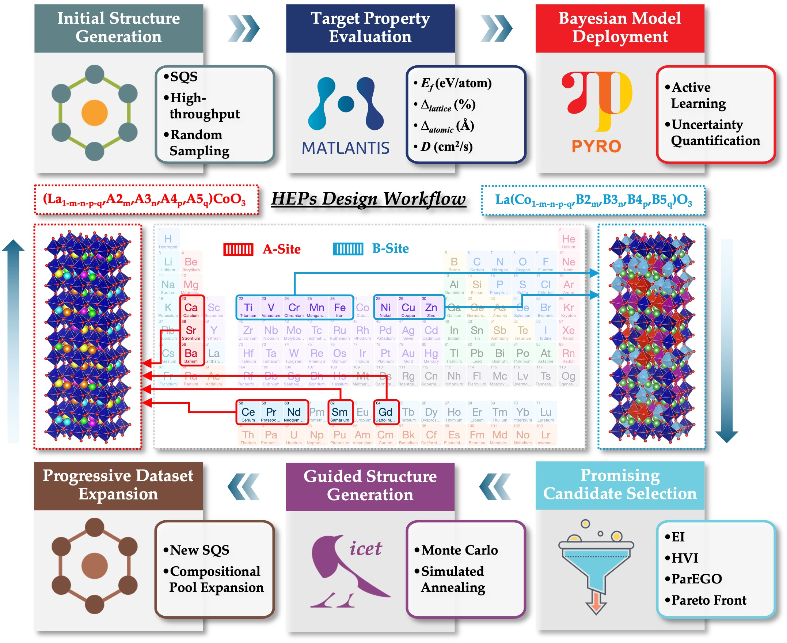

# HEP-Explorer

[](https://doi.org/xxx.xxx/xxx.xxx)

## Overview

An application for analyzing substitutional effects in high-entropy perovskites (HEPs), supporting compositional screening, property prediction, and performance optimization.

<div align=left></div>

## Get Started

* 🌐 [Try it Online](https://hep-explorer.streamlit.app/)

* ⭐️ Please STAR this repository if you find it helpful :)

* ✉️ Please contact us (gliu4@wpi.edu; yzhong@wpi.edu) for any questions or suggestions.

## Usage Description

1. **Select Substitutional Sites**: In the `Substitutional Sites` section, choose whether to substitute the A site or B site in the ABO3 perovskite structure. 

2. **Select Substitutional Elements**: In the `Substitutional Elements` section, select the desired substituents to form five-element high-entropy perovskites. Supported elements include:
    - A-site: Ca, Sr, Ba, Ce, Pr, Nd, Sm, Gd
    - B-site: Ti, V, Cr, Mn, Fe, Ni, Cu, Zn

3. **Select Substitutional Concentrations**: In the `Substitutional Concentrations` section, specify the concentration (at.%) for each selected substituent. Each substituent's concentration can range from 15 at.% to 40 at.%.

4. **Select System Conditions**: In the `System Conditions` section, specify the temperature (K) for the simulation. The temperature range is from 500 K to 2500 K. *Note that these settings only apply to diffusivity and conductivity predictions.*

5. **Predict**: Click the `Predict` button to initiate the prediction process. The system will process the input parameters and generate predictions for the target properties including formation energy (eV/atom), lattice distortion (%), atomic distance (Å), and diffusion coefficient (cm²/s).

## Cite Us
If you use this code in your research, please cite our paper:

```
@article{
  title={Unraveling Doping Effects in LaCoO3 via Machine Learning-Accelerated First-Principles Simulations},
  author={G. Liu and S. Yang and Y. Zhong},
  journal={},
  volume={},
  number={},
  pages={},
  year={2025}
}
```